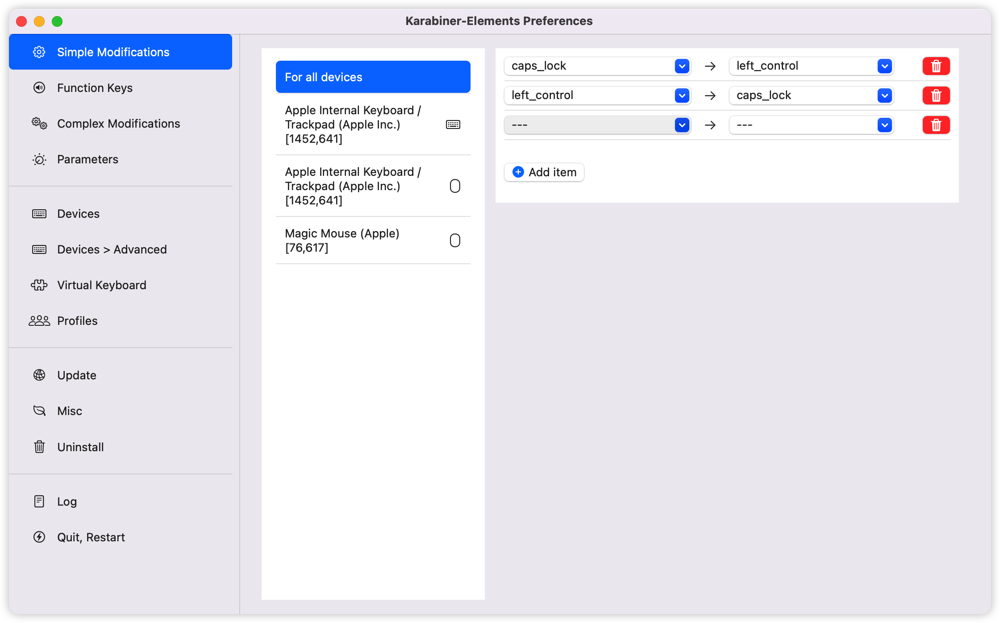
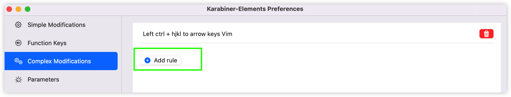
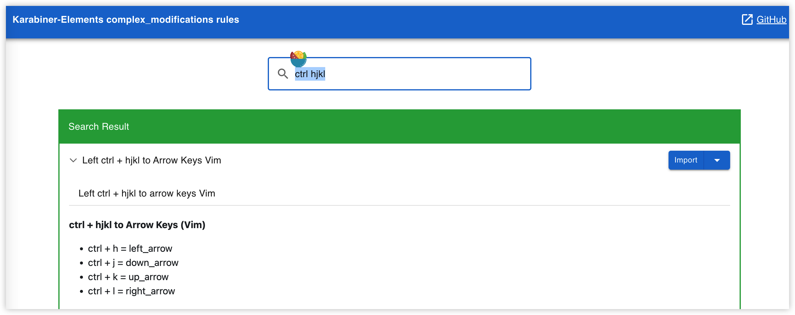
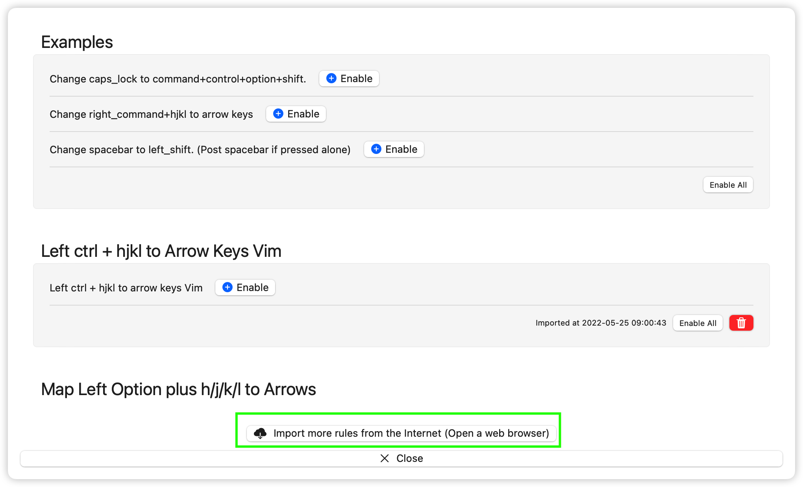
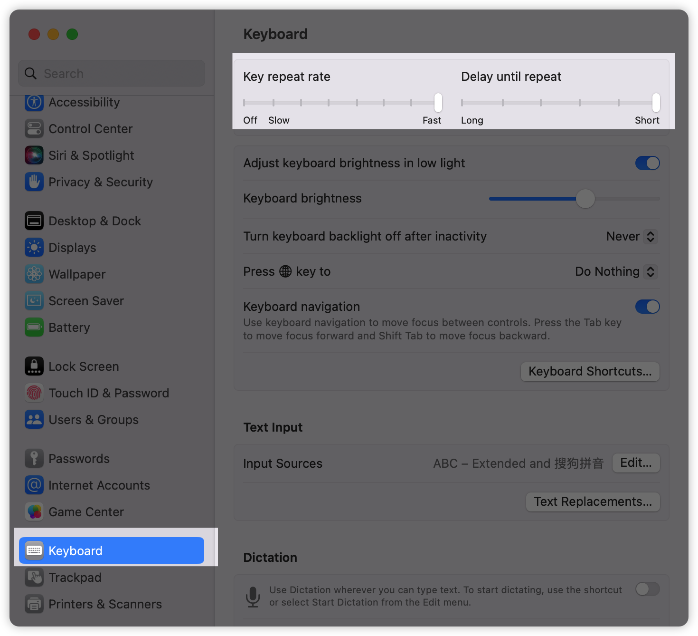

# Vim in vscode

本文档期望帮助你在 mac 上打造一套（几乎）全键盘的工作流程方案，用到的软件有 vscode，vim，iTerm2 ，hapiGo，Chrome 和它们的插件等。

当然，如果你只是想学习 Vim 的基本操作也是可以的，在 01-18 小节讲解了 Vim 的常用知识。

## 适合人群

- 想要学习 vim 的开发者，有过使用 vscode 的经验即可
- 使用 mac 的，想打造更高效快捷的工作流的开发者


## mac 环境配置

### 改键

使用 [karabiner](https://karabiner-elements.pqrs.org/) 这个软件改键

1. caps 大小写切换键其实用处不大，浪费了一个好位置，将其和 `ctrl` 键互换。
2. 方向键的位置平时不容易按到，结合 vim 的思想，上下左右改为 ctrl + hjkl（左下上右）。
3. 将 `ctrl+[` 映射为 `esc`。vim 原本就支持使用 `ctrl+[` 来 `esc`，平时在各种界面（比如浏览器输入框）也会经常使用到 `esc`，这样改的组合键不仅比 `esc` 本身更加好按到，也和 vim 保持了统一，比如在浏览器中，如果使用 `ctrl+[` 来使输入框失去焦点，再配合上后面会介绍的浏览器插件 `Vimium C` 来全键盘操作网页会更加容易。

互换左 ctrl 和 caps 键



ctrl + hjkl 与方向键，在 Karabiner-Elements 的 Preferences -> Complex Modifications -> Add rule -> Import more ... from Internet，会打开一个网页，搜索 `ctrl hjkl` 第一条就是，点击 Import，然后 Enable 即可。







在 Karabiner-Elements 的 Preferences -> Complex Modifications -> Add rule -> Import more ... from Internet，会打开一个网页，搜索 `vim style escape key mapping`，第一个即为这个规则，点击导入即可。

### 设置键盘响应

想要在 vim 中快速移动，还要关闭 apple 的长按设置命令，和修改 mac 键盘长按延迟。

查看 vscodevim 的[官方文档](https://github.com/VSCodeVim/Vim#mac)，对于 mac 用户，长按字母按键不是默认重复输入某个字母，所以需要在终端中设置，建议使用最后一条全局删除。

```sh
# If necessary, reset global defaults
$ defaults delete -g ApplePressAndHoldEnabled
```

修改键盘长按延迟，mac 系统设置中将这两项调为最快



## Last but not least

这份文档是参与 [cuixiaorui](https://github.com/cuixiaorui) 的 [键盘侠养成训练营](https://learn.cuixueshe.com/p/t_pc/goods_pc_detail/goods_detail/course_28y3lTEa0pnA2HVLtZiz1vQ2kH4?app_id=appewiejl9g3764) 的学习和讨论所整理的笔记，此外有参考另一位小伙伴的在线笔记 [JustVimIt](https://vim.nauxscript.com/)。感谢他们：）