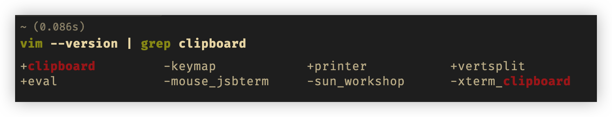

# 02 操作 Vim 的每一行

## 复制粘贴

复制当前行 `yy`

剪切（删除）当前行 `dd`

粘贴 `p`，注意 `yy` 和 `dd` 复制到的内容都是存储到 vim 的寄存器中，如果没有特别设置，vim 的寄存器会写入 mac 的系统的剪贴板，这样就有两个剪贴板。

## 插入

插入到行首，大写 `I`，并且是所在行第一个非 blank 字符前	
插入到行尾，大写 `A`
插入到下一行，小写 `o`
插入到上一行，大写 `O`


## 移动

### 行首

- 数字 `0`，移动到光标所在行的第一个字符处
- `^`，移动到光标所在行第一个不是 blank 字符的位置，blank：空格、tab、回车、换行，使用更多
- 改键，思路：将 `^` 改为 H，更为方便，`H` 本身是使光标到屏幕顶行。

### 行尾

- `$`，到光标所在行最后一个字符处
- `g_`， 到光标所在行最后一个不是 blank 字符的位置
- 改键，将 `^` 改为 `L`， 由于代码末尾一般没有 blank 字符，所以使用 `$` 还是 `g_` 区别不大，不过 `L` 比起 `$` 相对好敲到一些，可以改键。`L` 本身是使光标到屏幕的末行（注意不是文件的末尾）。


## 如何改键

vscode 中 vim 如何改键呢？

在 `settins.json` 中配置：

```json
// vim settings
"vim.normalModeKeyBindings": [
  {
    "before": ["H"],
    "after": ["^"]
  },
  {
    "before": ["L"],
    "after": ["g", "_"]
  }
]
```

## 扩展

### vscode vim 模式

vscode vim 配置的几个模式 https://github.com/VSCodeVim/Vim#key-remapping

 	1. vim.insertModeKeyBindings
 	2. vim.normalModeKeyBindings
 	3. vim.visualModeKeyBindings
 	4. vim.operatorPendingModeKeyBindings

### vim 寄存器和系统剪贴板

:::tip

这个部分会有一点难度，可先跳过

:::

#### vim 寄存器

vim 寄存器类似于 vim 的剪贴板，用来暂存复制剪切操作的内容。

使用 `:reg` 可以查看 vim 寄存器中的内容，vim 支持的寄存器非常多，其中常用的有 `a-zA-Z0-9+`等等。使用 `"ay` 复制到寄存器 a，使用 `"ap` 将寄存器 a 中的内容粘贴到光标后面；使用 `"2p` ，从寄存器`2` 中粘贴。**注意要打单个双引号**。


```
// vim 复制粘贴的用法总结，注意双引号
// 复制
yy 			// 复制当前行
bvey 		// 复制当前单词
"2y			// 指定复制到寄存器 2
"ay 		// 指定复制到寄存器 a
// 粘贴 normal 模式下
"2p 从寄存器 2 中粘贴
"ap 从寄存器 a 中粘贴
"+p 表示从系统剪贴板粘贴（如果vim版本支持）
// 粘贴 insert 模式下
ctrl+r 	// 再输入剪贴板名称，即可
```


#### 系统剪贴板

vscode 中可以直接用 `cmd+c` 进行复制，但是对于终端中的 vim，**如果想要复制到系统剪贴板**

首先，先要确定 vim 是否支持复制到剪贴板

```sh
vim --version | grep clipboard
```



如上图所示，结果中出现 `+clipboard` 就代表 vim 支持复制到剪贴板，如果不支持，就要安装更新版本的 vim。

用 `"+y` 代替 `y` 复制，则会复制到系统剪贴板

用 `"+p` 代替 `p` 将剪贴板内容复制到指定位置，当然可以直接用 `cmd+v`

`d x c s` 也一样，前面加 `"+` 双引号和加号。


如果想偷懒用 `y` 直接把内容复制到系统剪贴板，需要到 vim 配置文件 `.vimrc` 中添加

```sh
set clipboard=unnamed
```

但是不建议这样设置，因为这样就少一个剪贴板。