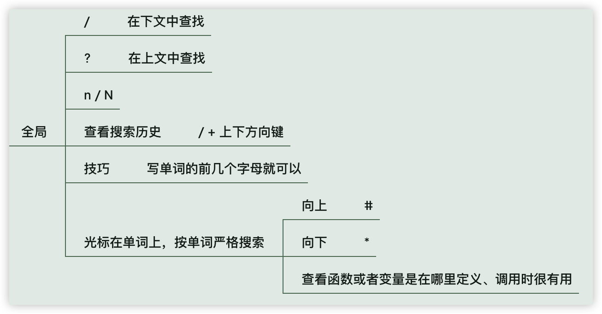

# 08 掌握搜索

全局搜索和行内搜索，实际上行内搜索意义不大，我们先来看全局搜索

## 全局搜索

在单个文件中全局搜索：

- 在下文中查找 `/`
- 在上文中查找 `?`
- 查看搜索历史 `/+上下方向键`
- 在搜索结果中跳转，跳到下一个结果 `n`，跳到上一个结果 `N`
- 技巧：使用 `/?` 查找时是模糊搜索，不区分大小写，写单词前几个字母即可

:::tip

**严格搜索某个单词：**

将光标移动到单词上，向下查找 `*`，向上查找 `#`，这个查看函数或这个变量是在哪里定义、调用时很有用。

:::

## 行内搜索

行内搜索我个人用得不多，仅作记录。

- `f` + 字符：自左往右移动光标到下一个匹配的字符中
- `F` + 字符：自右往左移动光标到下一个匹配的字符中
- `t` + 字符：自左往右移动光标到下一个匹配的字符的前一个字符中
- `T` + 字符：自右往左移动光标到下一个匹配的字符的后一个字符中
- `;`：重复执行上一个搜索命令
- `,`： 与上一个命令方向相反地执行上一个搜索命令（相对于 `;`）

技巧：移动的时候用 `f` ，结合 `c/d` 使用 `t`， 结合数字使用，`d2te` 删除到本行第二个 e 前面