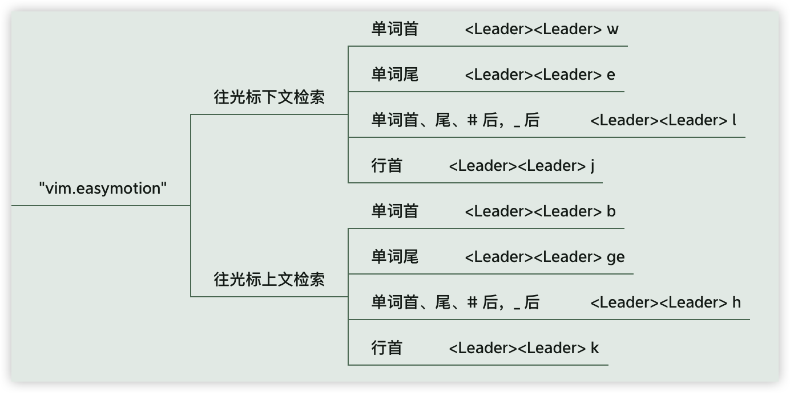

# 09 Vim 任意门

vim-easymotion 插件，想去哪就去哪，就和其名字一样，有了“任意门” easymotion，一切都变得 easy 起来。


## 配置插件

照着官方文档中配置 [vscodevim](https://github.com/VSCodeVim/Vim#quick-example)：


```json
"vim.easymotion": true, // 开启 easymotion 插件
// "vim.leader": "\\", 将 leader 键更改为空格键，更加方便
"vim.leader": "<Space>",
```


## 跳转



> 结合按单词跳转的键和 jkhl 来记忆

### 往光标下文

**行首**  `<Leader><Leader>j`

单词首 `<Leader><Leader> w`

单词尾 `<Leader><Leader> e`

单词首、尾、`#` 后、`_` 后 `<Leader><Leader> l`