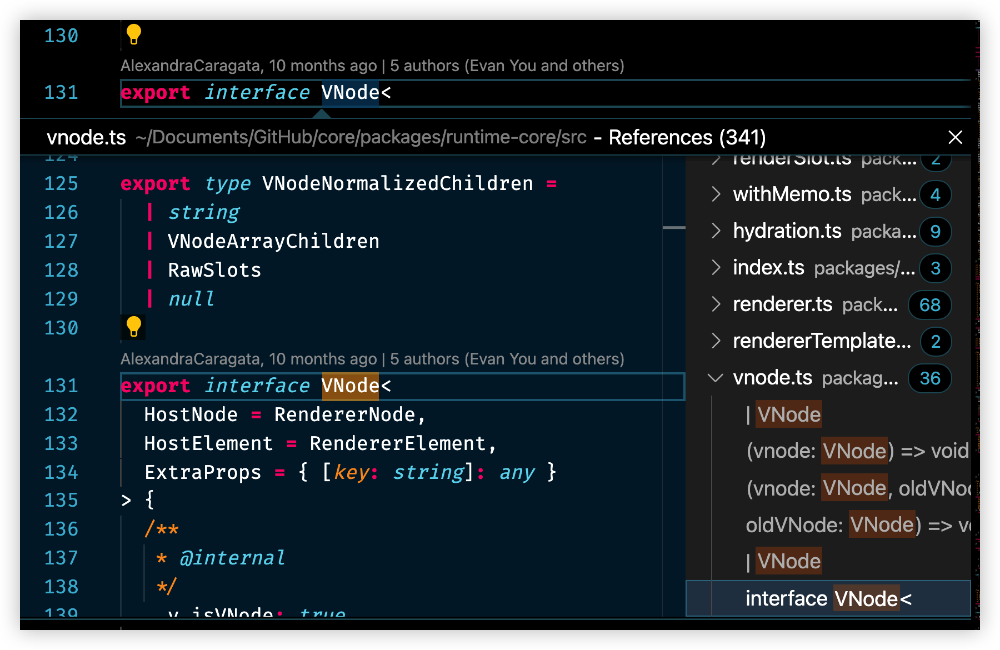

# 11 反复横跳

在开发时，经常需要在多个文件、多个代码段中进行跳转，“反复横跳”，一般的图形化编辑器可以手动点击，而vim 中是如何用纯按键完成这一切呢？

## 标记定位

就像在游戏地图上做的一个标记点，以后可以点击标记直接回来这里。

- `m` + 小写字母，推荐使用 `mm` ，小写字母的标记只能在单文件内跳转
- `m` + 大写字母，推荐使用 `mM` ，大写字母的标记可以在多文件间跳转使用

可以标记多个（使用不同的大、小写字母，但没必要，懒得记，三个够用了）

助记：mark —— `m`

## 跳转

任何大于一个单词或者超过当前行导航的移动，不仅可以在单文件内，也可以在多文件间跳转。

### 跳到标记点

`'` 单引号跳转到指定的行

 &#96; 单个反引号跳到指定的那一行那一列，更加精确

### 跳转历史

vim 会保留通过命令访问的位置（包括文件名、行号和列号），即跳转历史 jump list，且每个窗口都会有一个单独的 jump list，可以通过 `:jumps` 查看 jump list。

以下 vim 命令产生的跳转才会被记录到 jump list 当中：

- `'` 单引号跳转到指定的行
- &#96; 单个反引号跳到指定的那一行那一列，更加精确
- `gg`：跳转到文件首行（跳到文件尾行不算）
- `gd`：跳转到定义
- `/`：向下文搜索
- `?`：向上文搜索
- `n/N`：搜索命令后跳到下一个/上一个
- `{` 跳转到上一个段落（有空行）
- `}` 跳转到下一个段落

### 快捷键

`ctrl + o` 跳到之前所在的位置（jump list 的前一个记录）

`ctrl + i` 跳到 jump list 的后一个记录

## jump to definition

`gd` 这个命令太有用了，可以（跨文件）跳转到函数或者变量定义的位置，而在定义处使用 `gd` 可以显示出调用了该变量、函数的位置，`jk` 下上移动，`l` 展开目录，`h` 收起目录。

助记：go to definition

## 跳转示例

`gd` 查看定义代码，查看完成后，`ctrl+o` 跳转回原来的位置继续，又产生了疑问 `ctrl+i` 再跳转到定义代码处。

