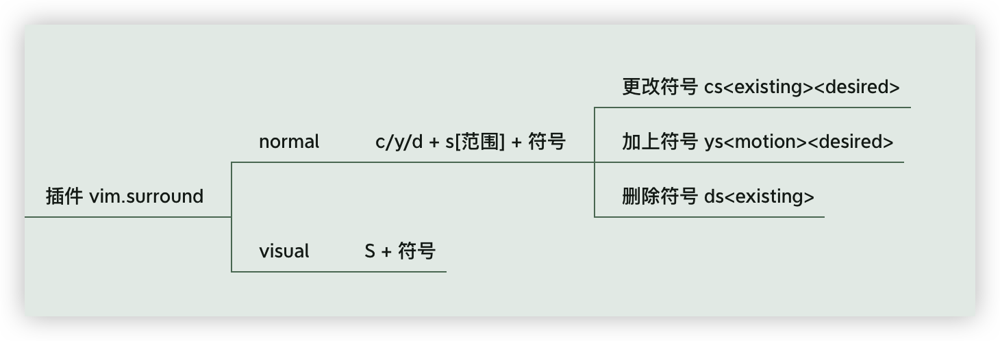

# 12 vim-surround

## 官方文档解读

> Surround.vim is all about "surroundings": parentheses, brackets, quotes, XML tags, and more. The plugin provides mappings to easily delete, change and add such surroundings in pairs.

我们之前学习了 vim 的文本对象，而 vim-surround 就是用来处理包裹文本对象符号的插件。


我们之前学习了 vim 的文本对象，而 vim-surround 就是用来处理包裹文本对象符号的插件。



vim-surround 插件，vscode vim 默认开启。

[官方文档示例](https://github.com/tpope/vim-surround)如下，已经十分全面

### normal 模式

我们有如下字符串，光标在它内部时 normal 模式下使用 `cs"'`

```text
"Hello world!"
```

则会变成以下这样：

```text
'Hello world!'
```

这时我们使用 `cs'<q>`，就变成了：

```html
<p>Hello world!</p>
```

再使用 `cst"`，就回到最初的模样，`t`  tag，指的是 text object 中 xml、html 标签

```text
"Hello world!"
```

删除包裹的符号，我们使用 `ds"`：

```
Hello world!
```

如果我们把光标移到 `hello` 单词上，输入 `ysiw]`，则变成这样：

```
[Hello] world!
```

如果我们要把中括号变成花括号并且单词和符号之间要有空格，我们可以使用 `cs]{` （如果使用 `}` 则添加的花括号是没有空格的，`)` `]` 同理）：

```
{ Hello } world!
```

这时，我们还可以通过 `yssb` 或 `yss)` 来给整行添加包裹，多一个 `s` 表示一行


```
({ Hello } world!)
```

输入 `ds{ds)` 去掉所有包裹：

```
Hello world!
```

对于前端开发来说，他是一个很有用的插件；比如我们现在有一个这样的标签：

```html
<p>hello world</p>
```

### 可视模式

这时我们使用 `V` 进入 linewise visual model（行内可视化模式），再键入 `S<div class="important">`，就变成了：


```html
<div class="important">
<p>hello world</p>
</div class="important">
```

这里会有一个 bug，就是结束标签上会多出不想要的信息，所以建议只输入标签。

使用 `V` 进入 linewise visual model（行内可视化模式），选中再键入 `S<div>`，就变成了：

```html
<div class="important">
<p>hello world</p>
</div>
```

## 更多实用示例

### 1. change existing surround to disired

normal mode

```
c s <exsiting> <disired>
```

例如，一开始使用单引号或者双引号，想换成模板字符串

```js
const vipUsername = "vip${username}" // 一开始是双引号
// 在 normal mode，光标停留在这个字符串上，停留在引号上也可以
// cs"`
// 可得
const vipUsername = `vip${username}`
```

### 2. Add desired surround around text defined by

normal mode

向单词周围添加符号，比如给某个单词添加大括号：`y s i w {`

```
y s <motion> <desired>
```

### 3. Delete existing surround 

normal mode

```
d s <existing>
```

### 4. Surround when in visual mode

visual mode

```
S <desired>
```

比如：给一句话加引号——v 选中，大写 `S"`


