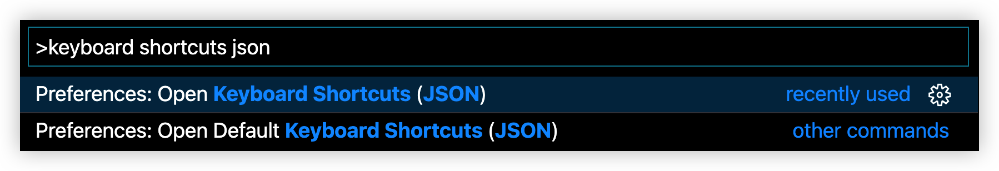

# 15 vim 掌握窗口的管理

## vim 窗口管理

:::tip
助记：`ctrl+w, [operation]`，管理窗口，接具体的命令

:::


### 新建窗口

- split right : `ctrl + w, v`，或者说 `<c-w>, v`

- split down : `ctrl + w, s`，或者说 `<c-w>, s`

### 窗口切换

- 两个窗口相互切换：`ctrl + w, w`

- 上下左右窗口切换：`ctrl + w, h/j/k/l`

### 关闭窗口

- `ctrl + w, c`

- `C-w o`，即 `ctrl + w, o`，只保留当前窗口，关闭其他所有的窗口，注意，在 vscode 中使用这条命令时不仅会关闭 editor 的窗口，资源管理器等窗口也会被关闭。


## vscode 窗口管理快捷键


### 关闭窗口

1. `cmd + w` 关闭当前窗口；
2. `cmd + k`，然后 `w` 关闭所有窗口

### 新建窗口

1. `cmd + \` split right
2. `cmd + ctrl + \` split down

### 窗口切换

shift + 方向键

配置方法：

`cmd + shift + p` 打开 vscode 命令面板，输入 `keyboard shortcuts json`，回车



添加配置，注意上面的最后一个配置项的 `}` 后记得加 `,`，另外 `vim.mode` 的 `Normal` 第一个字母必须大写，不然配置不生效。这里主要是介绍一下如何配置映射到vim 的快捷键，实际上 `ctrl+w, h/j/k/l` 的组合非常方便，不太需要转变。

```json
{
    // window move left
    "key": "shift+left",
    "command": "vim.remap",
    "when": "vim.mode == 'Normal'",
    "args": {
        "after": [
            "<c-w>",
            "h"
        ]
    }
},
{
    // window move right
    "key": "shift+right",
    "command": "vim.remap",
    "when": "vim.mode == 'Normal'",
    "args": {
        "after": [
            "<c-w>",
            "l"
        ]
    }
},
{
    // window move up
    "key": "shift+up",
    "command": "vim.remap",
    "when": "vim.mode == 'Normal'",
    "args": {
        "after": [
            "<c-w>",
            "k"
        ]
    }
},
{
    // window move down
    "key": "shift+down",
    "command": "vim.remap",
    "when": "vim.mode == 'Normal'",
    "args": {
        "after": [
            "<c-w>",
            "j"
        ]
    }
},
```

