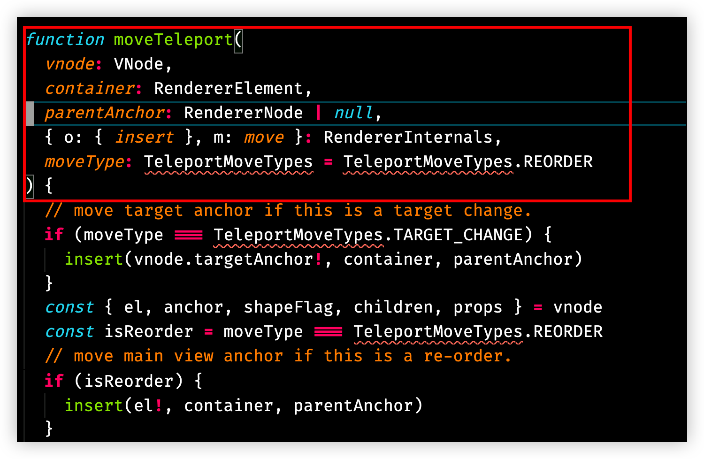
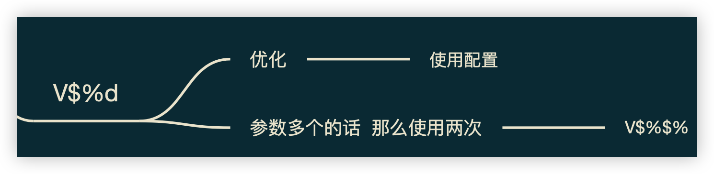
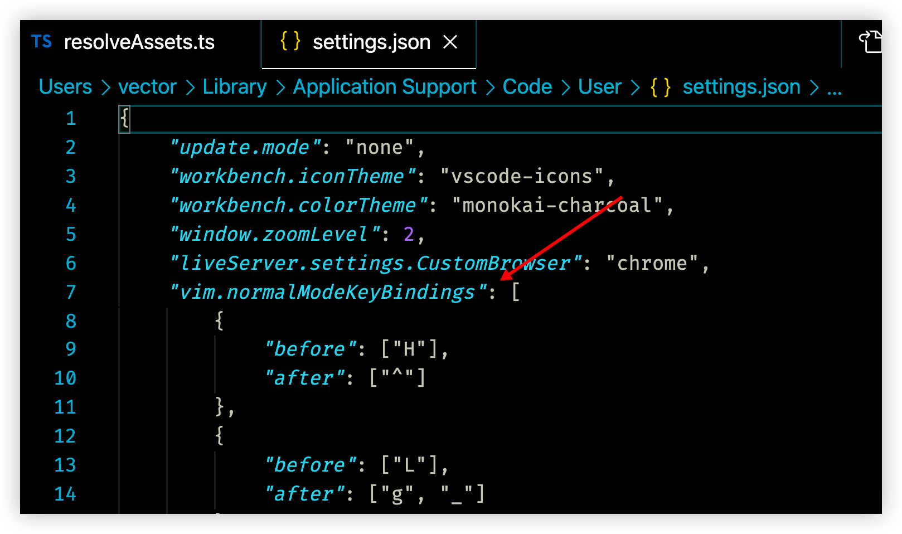

# 16 vim 如何删除一个函数

> 弃我去者，昨日之日不可留。

删除一个函数，或者删除一个函数的函数体再重新实现它，这是一个很常见的操作。

之前提过段落这样的文本对象，即用空行包裹的文本行。我们可以使用 `dap` 来删除一个段落（连续的文本行，中间没有空行），容易想到使用这种方法也能帮助我们删除函数。但是如果是函数体中有空行呢？如：

```js
function test(a, b) {
  a = 0;
  a++;
  console.log(a);
  
  b = 1;
  b--;
  console.log(b);
}
```

除了多次使用 `dap` 有没有更好地办法呢？有没有类似段落的，表示函数的文本对象呢？

## 匹配括号

`%` —— 匹配括号，包括小括号 `()`，中括号 `[]`，和大括号 `{}`。

当光标在括号上时，使用 `%` 会跳转到与之匹配的括号上。当光标在括号中的内容上，会调到左边的括号上。

在编辑代码时，经常需要从 `()[]{}` 这些括号的左括号跳转到右括号，特别是用 `{}` 包裹的代码块，我们需要查看匹配的大括号。`%` 这个命令十分有用。另外，注意，`{/}` 是按段落跳转，段落即用空行分隔的文本行。

## vim indent object

以缩进为单位的对象 `i`(indent)

- `>ii` 可以把同一个缩进级别的内容全部向右移动一个缩进，第一个 `i` 表示 inner 内部对象，第二个 `i` 表示 indent 缩进对象
- `<ii` 同上，可以向左移动一个缩进

而对于函数，也是缩进的文本对象，可以使用

| Command        | Description                                                  |
| -------------- | ------------------------------------------------------------ |
| `<operator>ii` | This indentation level <br />按照缩进，对函数体内部代码进行操作，比如 `dii`，删除函数体内部代码 |
| `<operator>ai` | This indentation level and the line above (think `if` statements in Python) <br />对于完全使用缩进，没有大括号的语言，比如 Python，`vai` 包括缩进对象和上一行 |
| `<operator>aI` | This indentation level, the line above, and the line after (think `if` statements in C/C++/Java/etc)<br />对于使用大括号的语言，比如 JS/TS/Java，`vaI` 包括缩进对象和上一行，包括缩进对象和它的上一个和它的下一行 |

建议在删除前进入可视化模式，确定要删除的范围

[参考链接](ttps://github.com/VSCodeVim/Vim#vim-indent-object)

## 删除函数实践

对于一般的、参数只有一行的函数

- 从函数第一行开始选中 `V$%d` ，最推荐这个。`V` 进入行可视化模式，`$` 将光标移到行尾，对于函数来说，一般是 `{` 左大括号，然后用 `%` 把光标移动到与它匹配的 `}` ，至此，就选中了整个函数
- 从函数体中按缩进选中 `daI`
- 基于段落 text-object，如果函数体中有空行就不行了，`dap`

另外，对于参数较多不只一行的函数



`V%$%`，或者说把 `L` 改成行尾了，可以 `V%L%`，第一个 `%` 用来匹配参数列表的右小括号 `)` 然后用 `$` 将光标移动到 `{` 上，第二个 `%` 来匹配 `}`。




不必要每次在 `V` 大写 v 后面加 `$` 来到行尾，因为实测好像按行进入可视模式，光标会默认来到行尾。改键配置的思路值得学习，如果你觉得操作不舒适，可以使用映射来优化操作步骤。


## 优化配置思路

配置映射，用快捷键删除函数，这里是在 normal 模式下：




在 settings.json 文件，箭头所指的配置项中，添加：

```json
{
  	"before": ["<Leader>", "d", "f"],		// delete function
  	"after": ["V", "$", "%", "d"]
},
{
  	"before": ["<Leader>", "d", "d", "f"], 
		"after": ["V", "$", "%", "$", "%", "d"]
},
```


