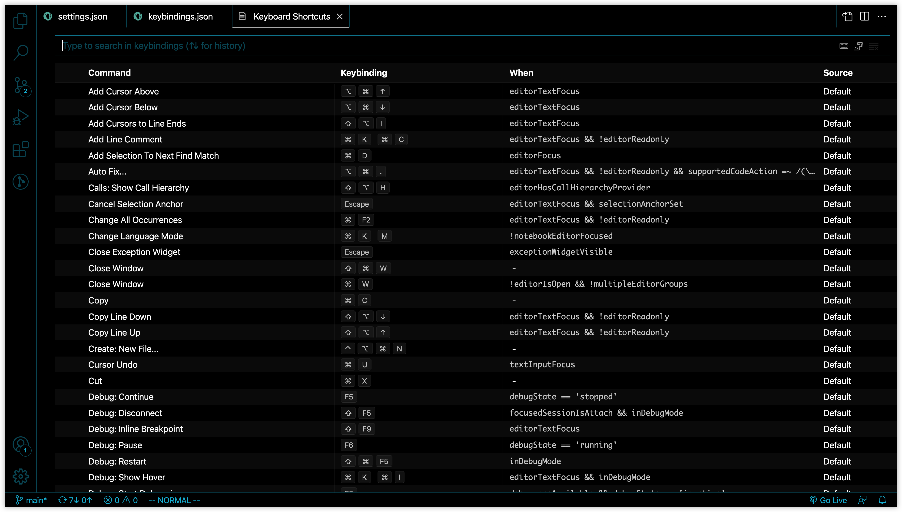
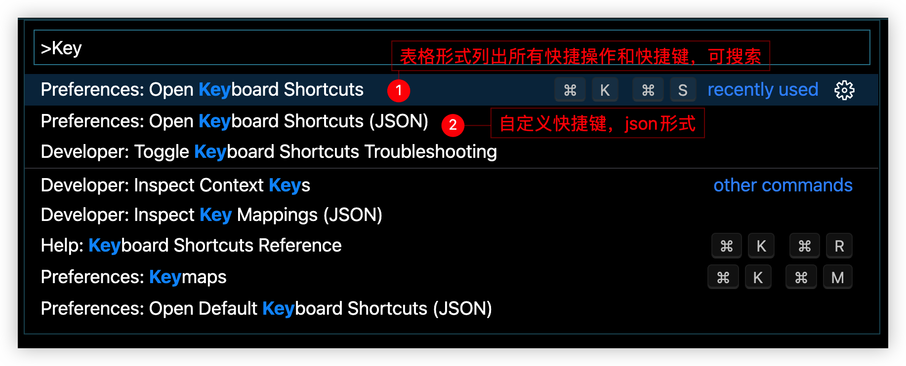

# 18 vim 和 vscode 我全都要

我全都要.jpg

vscode + vim = 鱼和熊掌可以兼得

如何在 vim 中用纯键盘调用 vscode 的命令呢？


## 举个例子

在我们修改代码 ~~或者从网上复制粘贴代码之后lol~~，代码的缩进格式经常会被打乱，这时 Format document 格式化文档就显得很有必要。但是 vscode 默认的快捷键 `shift+option+f` （window 下为 `shift+alt+f`），比较难按。那么我们能不能给 vim 增加命令来调用这个快捷键呢？


## vscode 快捷键设置

vscode 本身有很多快捷功能，可以通过 `cmd+k, cmd+s` 组合键来打开 Keyboard Shortcuts 设置的图表界面




也可以 `shift + cmd + p` 调出 vscode 的命令面板，输入 `Keyboard Shortcuts` ，选择 Preference: Open Keyboard Shortcuts 这一项。



## 配置方法

在 settings.json 中配置 vim 命令来调用 vscode 命令，以 Format document 格式化文档为例：

`cmd+k, cmd+s` 打开 Keyboard Shortcut 表格界面，然后搜索 Format document ，右键点击，然后 copy command id `editor.action.formatDocument`，粘贴到 settings.json 中进行配置：

```json
  "vim.normalModeKeyBindings": [
    {
      "before": ["<Leader>", "f", "d"],
      "commands": ["editor.action.formatDocument"]
    },
  ]
```

关于 `<Leader>` 键，见[Vim任意门](./09Vim任意门.html)

## 展开和折叠代码

- `za` 展开或折叠当前可折叠区域，这个就够用了
- `zC` 把光标所在的可折叠区域及其内部可折叠的内容

 还有一些，其实感觉就 `za` 最好用，就不过多赘述了。

