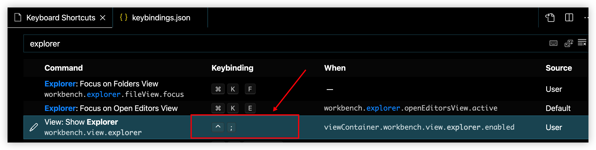
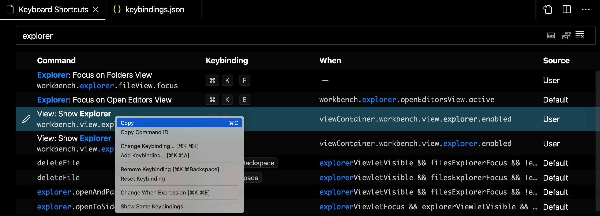
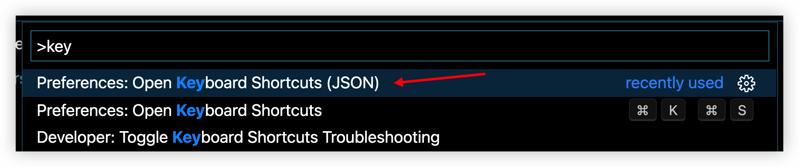
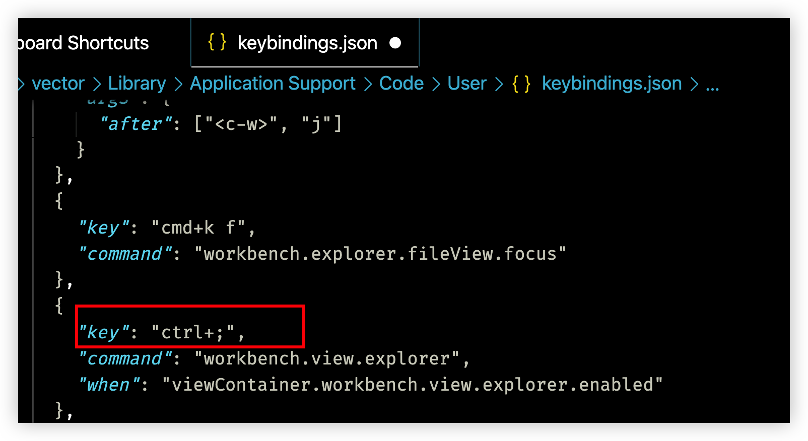
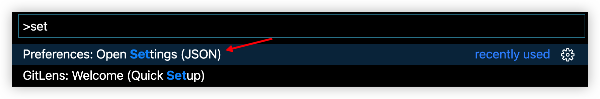
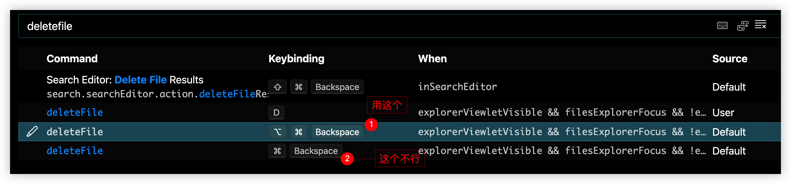
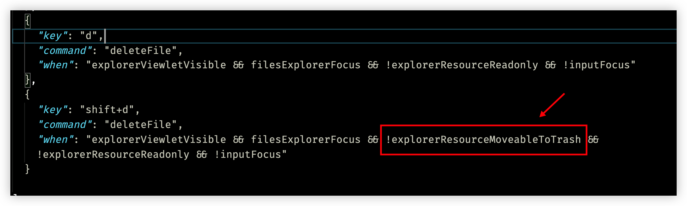
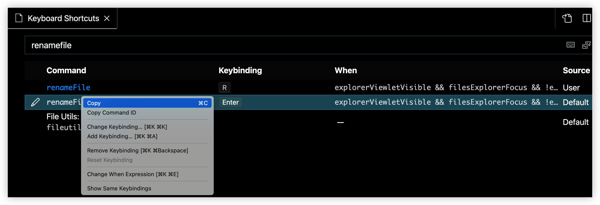

# 19 vscode 操作文件

前 18 天我们学习、练习了 vim 的主要操作，而 vscode 作为一款更加现代化的代码编辑器，本身就有着强大的功能和丰富的社区插件生态，来看看 vscode 各种功能，将这个目前最流行的现代编辑器打造成更趁手的 “瑞士军刀”吧：）

## 焦点切换

### 切到 files explorer 区域

使用快捷键将焦点切换到文件资源管理器窗口。

`cmd + k, cmd + s` 打开 Keyboard Shortcuts，搜索 explorer，就是 View: Show Explorer 这一项，双击框住的部分，输入自己设置的快捷键，这里我设置的是 `ctrl + ;`



或者通过 keybindings.json 设置，右键复制该项



打开 keybindings.json



粘贴，将 key 改为自己设置的快捷键组合



### 切到 editor 区域

同上，keybindings.json 中添加：

```json
	// put your cursor back to editor
  {
    "key": "ctrl+'",
    "command": "workbench.action.focusFirstEditorGroup"
  },
```


### 注意

其实如果焦点已经在资源管理器上时，使用 `ctrl+;` 就会使焦点回到编辑区域。

## 移动光标

在资源管理器中移动焦点：

- 在 file explorer 中可以使用 `kj` 上下移动

- 在 file explorer 中可以使用 `h` 折叠文件夹，使用 `l`  展开文件夹，如果是文件，就会在编辑区打开该文件

**注意：**

`hjkl` 这些上下移动光标和折叠展开需要安装 vim 插件才可以，没有 vim 插件就不行。

## 增删改查文件

### 新建文件

vscode 新建文件的快捷键是 `cmd+n`，可能需要使用鼠标，非常简单，不多赘述。主要说说全键盘流如何操作。

在 files explorer 中可以通过 jkhl 来上下移动、展开折叠文件夹，所以创建文件的位置比较自由。

在 editor 中，借助 vim 新建文件，只适合在当前目录下创建。

#### 在 files explorer

配置 keybindings.json，然后再 files explorer 中就可以通过小写 `a` 来创建新文件了通过大写 `A`，即 `shift+a`来创建文件夹，

```json
  {
    "key": "a",
    "command": "explorer.newFile",
    "when": "filesExplorerFocus && !inputFocus"
  },
  {
    "key": "shift+a",
    "command": "explorer.newFolder",
    "when": "filesExplorerFocus && !inputFocus"
  },
```

对于文件夹，注意是 `shift+a`，写 `A` 不行，实际上 vscode 的快捷键只记录你按下的键，而不区分大小写，如果 key 设置为 `A` 的话，像这样：

```json
  {
    "key": "a",
    "command": "explorer.newFile",
    "when": "filesExplorerFocus && !inputFocus"
  },
  {
    "key": "A",
    "command": "explorer.newFolder",
    "when": "filesExplorerFocus && !inputFocus"
  }
```

下面这一项会覆盖 key 为 `a`  的这一项。即无论是大小写 `a`，都是新建文件夹，而小写 `a` 不能新建文件。


#### 在 editor

可以在 editor，借助 vim 来新建文件和文件夹：

会创建到当前目录下（explorer 中光标所在的目录下，不一定是 editor 中正在编辑的文件的目录）

打开 settings.json，添加配置



```json
  "vim.normalModeKeyBindings": [
    // vim call vscode commands
    {
      "before": ["<Leader>", "n", "f"],
      "commands": ["explorer.newFile"]
    },
    {
      "before": ["<Leader>", "n", "d"],
      "commands": ["explorer.newFolder"]
    }, 
	]
```


> 这里用 `<Leader>` 加上任意自己顺手的键组合成命令就可以，nd 主要代表 new directory，因为 nf（newFolder）已经被 newFile 用了，d 和 f 在键盘上也是相邻的，逻辑上和物理上都比较好记。

### 删除文件

焦点在资源管理器中删除文件，vscode 自带快捷键 `command` + `delete`，配置更快的快捷键，直接按 `d` 删除：

复制该项，粘贴到 keybindings.json 中，将 key 改为 `d` 即可。

```json
  {
    "key": "d",
    "command": "deleteFile",
    "when": "explorerViewletVisible && filesExplorerFocus && !explorerResourceReadonly && !inputFocus"
  }
```


解释一下为什么下面那个不行，`"when"` 中多了一个条件 `!explorerResourceMoveableToTrash`，应该是指不可删除，这个条件很奇怪，不知道是不是 vscode 的 bug （or feature）



### 重命名文件

焦点在资源管理器中重命名文件，vscode 自带快捷键 `<enter>`，好用，也可以配置按 `r` 重命名：



复制该项，粘贴到 keybindings.json 中，将 key 改为 `r` 即可。

```json
  {
    "key": "r",
    "command": "renameFile",
    "when": "explorerViewletVisible && filesExplorerFocus && !explorerResourceIsRoot && !explorerResourceReadonly && !inputFocus"
  },
```


### 查看文件

`cmd+p`

不需要额外配置，vscode 最常用的操作之一，使用 `cmd+p` ，输入想查看的文件名，上下移动选择文件，回车，就会在编辑区打开文件。


## 使用插件 file Utils 操作文件

在插件中心搜索 file utils，文档很详细，动图基本说明了用法，感觉也很好用。`shift+cmd+p`调出命令面板，输入命令 new file/delete file/new folder  等即可。

